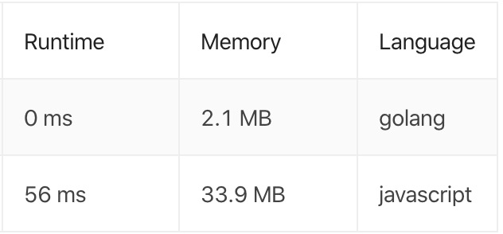

### 题目地址
https://leetcode.com/problems/binary-tree-postorder-traversal/

### 描述

Given a binary tree, return the postorder traversal of its nodes' values.

**Example:**

```
Input: [1,null,2,3]
   1
    \
     2
    /
   3

Output: [1,2,3]
```

**Follow up:**

Recursive solution is trivial, could you do it iteratively?

### 代码
Javascript: (递归)
```javascript
function postorderTraversal (root) {
    const mValues = []
    if (!root) {
        return mValues
    }
    
    traversal(mValues, root)
    
    return mValues
}

function traversal (mValues, node) {        
    if (node.left) {
        traversal(mValues, node.left)
    }
    if (node.right) {
        traversal(mValues, node.right)
    }
    mValues.push(node.val)
}
```
Go: (Iterative/迭代)
```go
func postorderTraversal(root *TreeNode) []int {
	if root == nil {
		return []int{}
	}

	traversal := make([]int, 0)
	stack := make([]*TreeNode, 0)

	current := root
	for current != nil || len(stack) > 0 {
		for current != nil {
			traversal = append(traversal, current.Val)
			stack = append(stack, current)
			current = current.Right
		}
		current = stack[len(stack)-1]
		stack = stack[:len(stack)-1]
		current = current.Left
	}
	return reverse(traversal)
}

func reverse(nums []int) []int {
	for i := 0; i < len(nums)/2; i++ {
		nums[i], nums[len(nums)-1-i] = nums[len(nums)-1-i], nums[i]
    }
    return nums
}
```

### 运行结果对比


可以看到非递归算法比递归算法的性能要好很多