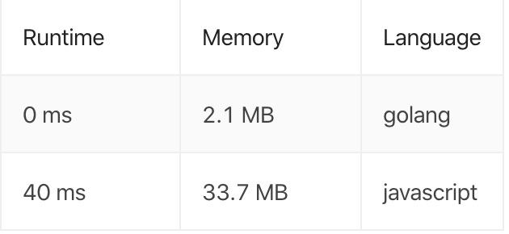

### 题目地址
https://leetcode.com/problems/binary-tree-inorder-traversal/

### 描述

Given a binary tree, return the inorder traversal of its nodes' values.

**Example:**

```
Input: [1,null,2,3]
   1
    \
     2
    /
   3

Output: [1,3,2]
```

**Follow up:**

Recursive solution is trivial, could you do it iteratively?

### 代码
Javascript: (递归)
```javascript
/**
 * Definition for a binary tree node.
 * function TreeNode(val) {
 *     this.val = val;
 *     this.left = this.right = null;
 * }
 */
function inorderTraversal (root) {
    const mValues = [];
    if (!root) {
        return mValues;
    }
    
    traversal(mValues, root);
    
    return mValues;
}

function traversal (mValues, node) {
    if (node.left) {
        traversal(mValues, node.left);
    }
    
    mValues.push(node.val);
    
    if (node.right) {
        traversal(mValues, node.right);
    }
}
```
Go: (Iterative/迭代)
```go
func inorderTraversal(root *TreeNode) []int {
	if root == nil {
		return []int{}
	}

	traversal := make([]int, 0)
	stack := make([]*TreeNode, 0)
	current := root
	for current != nil || len(stack) > 0 {
		for current != nil {
			stack = append(stack, current)
			current = current.Left
		}
		current = stack[len(stack)-1]
		stack = stack[:len(stack)-1]
		traversal = append(traversal, current.Val)
		current = current.Right
	}
	return traversal
}
```

### 运行结果对比
